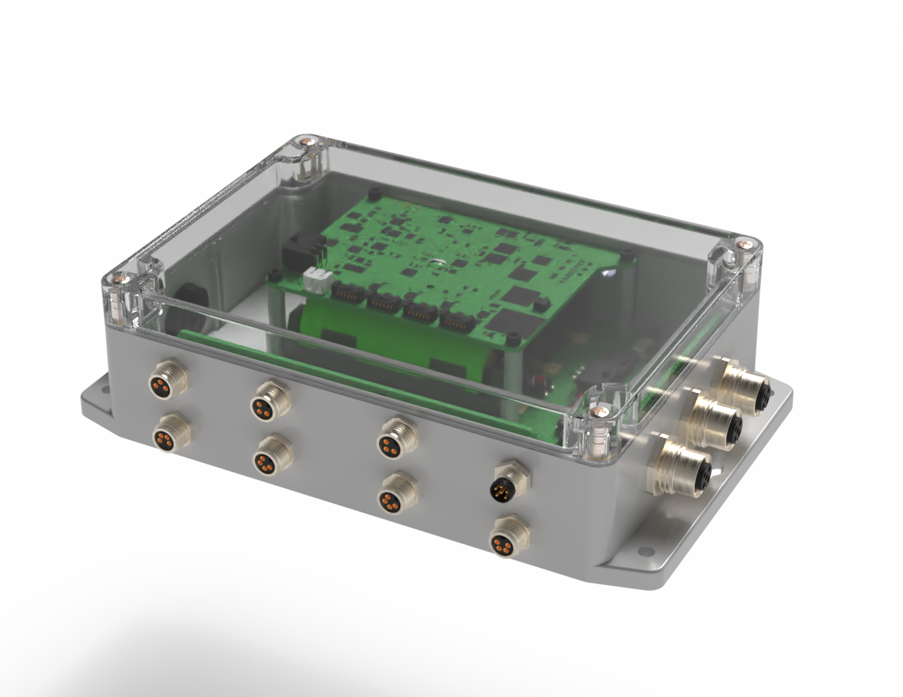
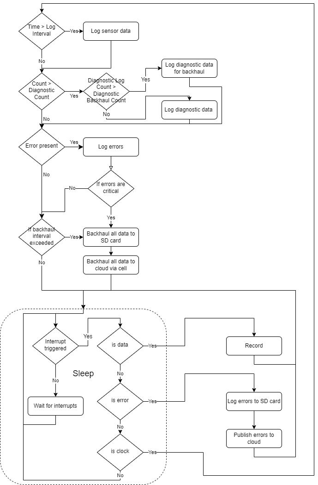
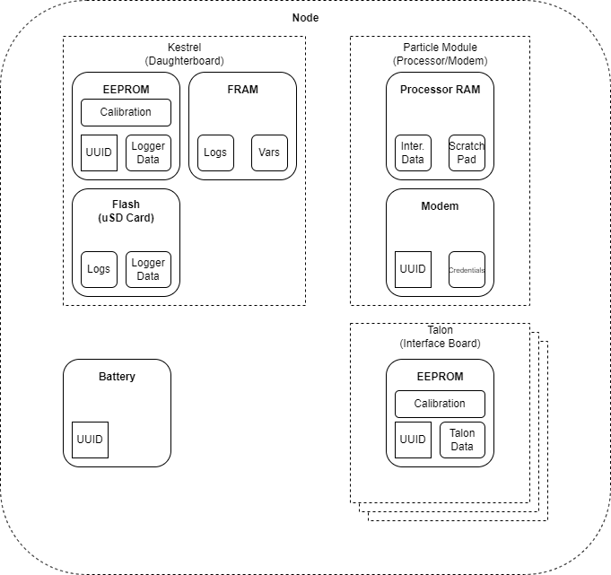
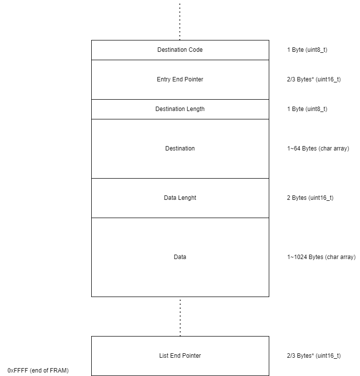
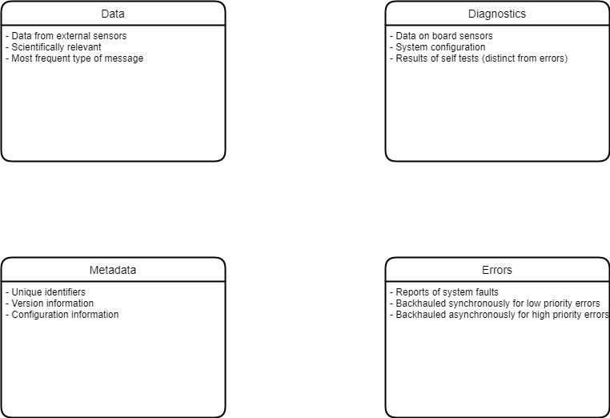

# Project-Flight
System overview of the Flight (v3) GEMS Sensing data logger

# Repo Roadmap
#### [Documentation](Documentation/)

General document and image storage for repo and README

<!-- #### [Hardware](Hardware/)

Current board files (Eagle), and other electrical design documents

#### [Mechanical](Mechanical/)

Mechanical design files and assembly documents

#### [Production](Production/)

Contains the various Gerber and pick and place files required to have the Printed Circuit Boards (PCBs) manufactured or populated 

#### [Software](Software/)

The software associated with the piece of hardware, this is usually diagnostic software used for verifying or investigating the hardware -->

#### [Testing](Testing/)

Scripts and results from the testing process and development process. Contains more detailed information about documented issues among other testing. 

## Overview
* **Type:** Data Logger
* **Interfaces:** I2C, SDI-12, Analog, Digital[^1] 
* **Daughterboards:**
	* [Talon-I2C](https://github.com/GEMS-sensing/Talon-I2C)
	* [Talon-SDI12](https://github.com/GEMS-sensing/Talon-SDI12)
	* [Talon-Auxiliary](https://github.com/GEMS-sensing/Talon-Auxiliary)
	* [Gonk](https://github.com/GEMS-sensing/Project-Gonk)

[^1]: Dependent on Talon configuration]

## Testing
Testing for the system was validated using the extensive [Flight Test](Testing/Report/TestingReport-Flight.pdf) protocol 

## Firmware Operation

#### Backhaul Operation

#### Memory Usage

#### Message Types
